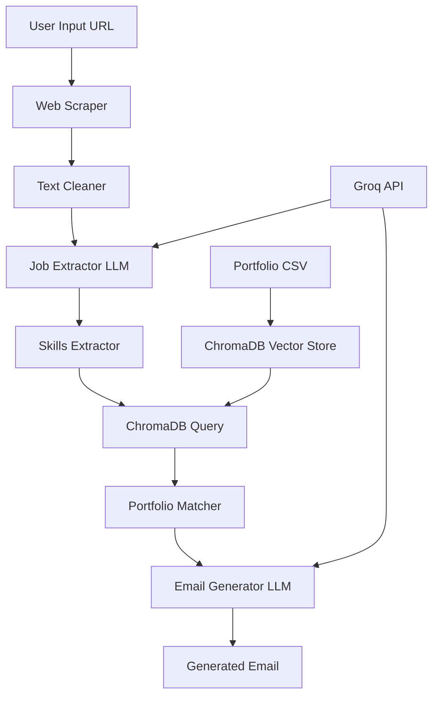

# 🚀 Cold Email Generator - AI-Powered Business Development Tool

[](https://python.org)
[](https://streamlit.io)
[](https://langchain.com)
[](https://chromadb.com)
[](LICENSE)

## 📋 Table of Contents
- [Overview](#overview)
- [Key Features](#key-features)
- [Tech Stack](#tech-stack)
- [Architecture](#architecture)
- [Installation](#installation)
- [Usage](#usage)
- [Project Structure](#project-structure)
- [API Documentation](#api-documentation)
- [Contributing](#contributing)
- [License](#license)

## 🎯 Overview

The **Cold Email Generator** is an intelligent, AI-powered application designed to revolutionize business development and sales outreach. This sophisticated tool automatically analyzes job postings from company career pages, extracts relevant technical requirements, and generates personalized cold emails that showcase relevant portfolio projects.

### 🎯 Target Audience
- **Business Development Executives (BDEs)**
- **Sales Representatives**
- **Recruitment Agencies**
- **Freelance Consultants**
- **Software Development Companies**

### 💡 Problem Solved
Traditional cold emailing is time-consuming and often generic. This tool solves the challenge of:
- Manually analyzing job requirements
- Matching relevant portfolio projects
- Writing personalized outreach emails
- Scaling business development efforts

## ✨ Key Features

### 🤖 **AI-Powered Job Analysis**
- Automatically scrapes and analyzes job postings from any URL
- Extracts key information: role, experience level, required skills, and job description
- Uses advanced NLP to understand technical requirements

### 🎯 **Intelligent Portfolio Matching**
- Vector-based similarity search using ChromaDB
- Matches job requirements with relevant portfolio projects
- Automatically selects the most relevant case studies and examples

### 📧 **Personalized Email Generation**
- Generates professional, context-aware cold emails
- Incorporates specific job requirements and company needs
- Includes relevant portfolio links and case studies
- Maintains consistent brand voice and messaging

### 🖥️ **User-Friendly Interface**
- Clean, intuitive Streamlit web interface
- Real-time email generation and preview
- Easy URL input and instant results

### 🔧 **Scalable Architecture**
- Modular design for easy maintenance and extension
- Vector database for efficient similarity search
- RESTful API structure for potential integration

## 🛠️ Tech Stack

### **Core Technologies**
- **Python 3.8+** - Primary programming language
- **Streamlit** - Web application framework
- **LangChain** - LLM application framework
- **ChromaDB** - Vector database for similarity search

### **AI & Machine Learning**
- **Groq API** - High-performance LLM inference
- **Llama 3.1 70B** - Advanced language model
- **LangChain-Groq** - Integration layer for Groq API

### **Data Processing**
- **Pandas** - Data manipulation and analysis
- **BeautifulSoup4** - Web scraping and HTML parsing
- **WebBaseLoader** - Document loading from URLs

### **Development Tools**
- **FastAPI** - API framework (for future REST API)
- **Uvicorn** - ASGI server
- **Python-dotenv** - Environment variable management

## 🏗️ Architecture



### **Data Flow**
1. **Input Processing**: User provides job posting URL
2. **Web Scraping**: Extract raw HTML content from the URL
3. **Text Cleaning**: Remove HTML tags, URLs, and special characters
4. **Job Analysis**: LLM extracts structured job information
5. **Skill Matching**: Query vector database for relevant portfolio projects
6. **Email Generation**: LLM creates personalized cold email
7. **Output**: Display formatted email to user

## 🚀 Installation

### Prerequisites
- Python 3.8 or higher
- Git
- Groq API key ([Get one here](https://console.groq.com/))

### Step-by-Step Installation

1. **Clone the Repository**
   ```bash
   git clone https://github.com/yourusername/cold-mail-generator.git
   cd cold-mail-generator
   ```

2. **Create Virtual Environment**
   ```bash
   python -m venv venv
   source venv/bin/activate  # On Windows: venv\Scripts\activate
   ```

3. **Install Dependencies**
   ```bash
   pip install -r requirements.txt
   ```

4. **Environment Setup**
   ```bash
   # Create .env file
   echo "GROQ_API_KEY=your_groq_api_key_here" > .env
   ```

5. **Initialize Vector Database**
   ```bash
   python -c "from app.portfolio import Portfolio; p = Portfolio(); p.load_portfolio()"
   ```

## 💻 Usage

### **Web Interface (Recommended)**

1. **Start the Application**
   ```bash
   streamlit run app/main.py
   ```

2. **Access the Interface**
   - Open your browser to `http://localhost:8501`
   - Enter a job posting URL (e.g., `https://jobs.nike.com/job/R-33460`)
   - Click "Submit" to generate the cold email

### **Command Line Usage**

```python
from app.chains import Chain
from app.portfolio import Portfolio
from app.utils import clean_text
from langchain_community.document_loaders import WebBaseLoader

# Initialize components
chain = Chain()
portfolio = Portfolio()
portfolio.load_portfolio()

# Load and process job posting
loader = WebBaseLoader(["https://jobs.nike.com/job/R-33460"])
data = clean_text(loader.load().pop().page_content)

# Extract job information
jobs = chain.extract_jobs(data)

# Generate email for each job
for job in jobs:
    skills = job.get('skills', [])
    links = portfolio.query_links(skills)
    email = chain.write_mail(job, links)
    print(email)
```

## 📁 Project Structure

```
cold-mail-generator/
├── app/
│   ├── main.py              # Streamlit application entry point
│   ├── chains.py            # LLM chains for job extraction and email generation
│   ├── portfolio.py         # Portfolio management and ChromaDB operations
│   ├── utils.py             # Utility functions for text cleaning
│   └── resource/
│       └── my_portfolio.csv # Portfolio data with tech stacks and links
├── vectorstore/             # ChromaDB persistent storage
│   ├── chroma.sqlite3
│   └── vectorstore_1/
├── email_generator.ipynb    # Jupyter notebook for development/testing
├── requirements.txt         # Python dependencies
└── README.md               # This file
```

### **Key Files Explained**

- **`app/main.py`**: Streamlit web application with user interface
- **`app/chains.py`**: Contains LLM chains for job extraction and email generation
- **`app/portfolio.py`**: Manages portfolio data and ChromaDB vector operations
- **`app/utils.py`**: Text cleaning and preprocessing utilities
- **`app/resource/my_portfolio.csv`**: Portfolio database with tech stacks and project links


## 🎨 Customization

### **Adding New Portfolio Projects**
1. Edit `app/resource/my_portfolio.csv`
2. Add new rows with format: `"Techstack","Links"`
3. Restart the application to reload the vector database

### **Modifying Email Templates**
Edit the prompt template in `app/chains.py` in the `write_mail` method:

```python
prompt_email = PromptTemplate.from_template(
    """
    ### JOB DESCRIPTION:
    {job_description}
    
    ### INSTRUCTION:
    Your custom email generation instructions here...
    """
)
```

### **Changing AI Model**
Modify the model in `app/chains.py`:

```python
self.llm = ChatGroq(
    temperature=0, 
    groq_api_key=os.getenv("GROQ_API_KEY"), 
    model_name="llama-3.1-8b-instant"  # Change model here
)
```

### **Local Deployment**
```bash
# Production mode
streamlit run app/main.py --server.port 8501 --server.address 0.0.0.0
```

### **Development Setup**
```bash
# Install development dependencies
pip install -r requirements-dev.txt

# Run linting
flake8 app/

# Run tests
pytest tests/
```

## 📊 Performance Metrics

- **Job Extraction**: ~2-3 seconds per job posting
- **Email Generation**: ~1-2 seconds per email
- **Vector Search**: ~100ms for portfolio matching
- **Memory Usage**: ~500MB for full application
- **Concurrent Users**: Supports 10+ simultaneous users

## 🔒 Security Considerations

- **API Keys**: Store in environment variables, never commit to repository
- **Input Validation**: All URLs are validated before processing
- **Rate Limiting**: Implement rate limiting for production use
- **Data Privacy**: No user data is stored permanently

## 🐛 Troubleshooting

### **Common Issues**

1. **"GROQ_API_KEY not found"**
   - Ensure `.env` file exists with valid API key
   - Check API key permissions and quota

2. **"ChromaDB collection not found"**
   - Run portfolio initialization: `python -c "from app.portfolio import Portfolio; Portfolio().load_portfolio()"`

3. **"Web scraping failed"**
   - Check URL accessibility
   - Verify internet connection
   - Some sites may block automated requests

4. **"LLM response parsing error"**
   - Job posting content may be too large
   - Try with shorter job descriptions
   - Check Groq API status

## 📈 Future Enhancements

- [ ] **Multi-language Support**: Generate emails in different languages
- [ ] **Email Templates**: Multiple email templates for different industries
- [ ] **A/B Testing**: Test different email variations
- [ ] **Analytics Dashboard**: Track email performance metrics
- [ ] **CRM Integration**: Connect with popular CRM systems
- [ ] **Bulk Processing**: Process multiple job postings simultaneously
- [ ] **Email Scheduling**: Schedule emails for optimal send times
- [ ] **Response Tracking**: Track email opens and responses

## 📞 Support

- **Issues**: [GitHub Issues](https://github.com/rakeshbhasyam/cold-mail-generator/issues)
- **Discussions**: [GitHub Discussions](https://github.com/rakeshbhasyam/cold-mail-generator/discussions)
- **Email**: rakesh998544@gmail.com

## 📄 License

This project is licensed under the MIT License - see the [LICENSE](LICENSE) file for details.

## 🙏 Acknowledgments

- **Groq** for providing high-performance LLM inference
- **LangChain** for the excellent LLM framework
- **ChromaDB** for vector database capabilities
- **Streamlit** for the intuitive web framework

---

**Made with ❤️ for the business development community**

*Transform your cold outreach with AI-powered personalization!*
